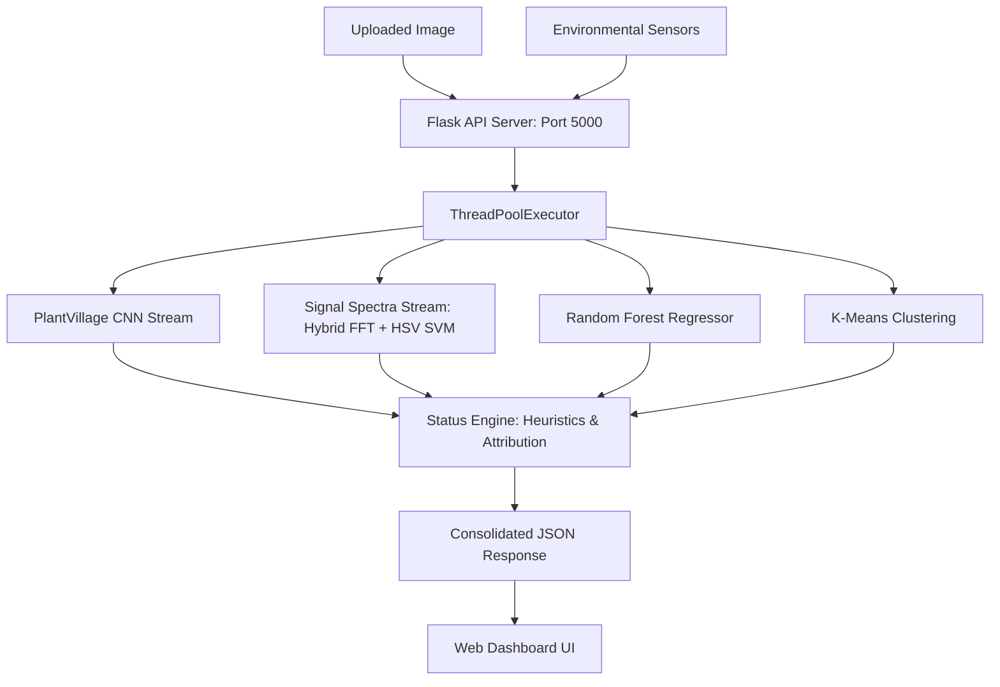

# Demeter: Intelligent Plant Growth Optimisation System

Demeter is a modular machine learning framework designed to bridge the "accessibility gap" in precision agriculture. By combining visual diagnostics with environmental data, the system provides home gardeners and small-scale farmers with high-fidelity insights into plant health, disease detection, and growth trajectories without the need for expensive industrial hardware.

**USYD 2026 SC1 - ENGG2112**

**Contributors:** Aman, Edward, Aneesh, Jack, The Honourable 5th Lab Partner

---

## 📌 Project Overview

Effective plant care is often hampered by a lack of real-time diagnostic tools. Demeter addresses this by utilizing a multi-stream machine learning and biological signal processing architecture:

1. **Deep Learning Visual Monitoring:** A fine-tuned Convolutional Neural Network (MobileNetV2 backbone) trained on leaf imagery to classify categories of healthy and diseased leaves.
2. **Biological Signal Processing (Frequency Domain):** An experimental/production Support Vector Machine (SVM) pipeline leveraging 2D Fast Fourier Transforms (FFT) and color distribution mapping (HSV/LAB spectra) to diagnose plant anomalies with a minimal computational footprint.
3. **Environmental Analytics:** A Random Forest Regressor mapping temporal environmental variables (temperature, soil moisture, sunlight hours) to predict growth milestones.
4. **Unsupervised Health Clustering:** A K-Means clustering algorithm that identifies latent phenotypic health states to segment crop status.
5. **Disclosed Heuristic Engine:** A rule-based Status Engine that translates raw predictions and sensor parameters into composite health scores and system actions (e.g., `ACTIVATE_WATER_PUMP`), with all deterministic rules explicitly marked with `[HEURISTIC]` tags.

---

## 🚀 Key Features

* **Multi-Stream Vision Diagnostics:** Compare deep learning CNN predictions side-by-side with lightweight biological frequency/color spectra SVM diagnostics in real time.
* **Growth Trajectory Prediction:** Forecast biomass delta and growth milestones based on longitudinal environmental data.
* **Phenotypic Health Clustering:** Automatic grouping of plant health into three distinct clusters: *Thriving*, *Struggling*, and *Critical*.
* **Actionable Recommendations:** Generate prioritized, data-driven suggestions for intervention.
* **Real-time Web Dashboard:** A responsive Flask API-powered interface to visualize crop metrics, historical graphs, and run live inferences via file upload.

---

## 🛠️ Technical Architecture & Pipeline



### 1. Visual Stream (CNN)
* **Model:** Transfer learning with MobileNetV2.
* **Dataset:** PlantVillage Dataset (~54,000 images, 15 target classes).
* **Role:** High-accuracy discrete leaf-level disease classification.

### 2. Signal Spectra Stream (Hierarchical Hybrid SVM)
* **Model:** Two-stage Hierarchical SVC (Support Vector Classifier) with RBF kernel.
* **Preprocessing Pipeline:**
  * **Otsu Segmentation:** Leaf region is isolated from background clutter.
  * **2D Fast Fourier Transform (FFT):** Magnitude spectrum is flattened, normalized, and reduced to the 100 most important frequency components via PCA.
  * **HSV Color Mapping:** A 64-bin color histogram maps pigment distribution.
* **Hierarchical Routing:** A primary SVM categorizes the broad species (e.g., Potato, Tomato, Pepper) and routes the extracted features to a secondary, species-specific SVM to diagnose the exact pathogen.
* **Role:** Ultra-lightweight, low-latency diagnostic model viable for edge/low-power hardware.

### 3. Growth Stream (Random Forest)
* **Model:** Random Forest Regressor.
* **Dataset:** Donald Danforth Plant Science Center.
* **Role:** Map continuous environmental variables to future growth milestones.

---

## 📂 Directory Structure

```text
Demeter/
├── config/                 # Configuration routing
│   ├── config.json         # Paths, model parameters, and thresholds
│   └── dataset-metadata.json
├── data/                   # Datasets, processed splits, and run outputs (Git ignored)
│   ├── raw/                # Raw vision (PlantVillage, Bellwether) and environment data
│   ├── processed/          # Bootstrapped training sets and pre-split test partitions
│   ├── outputs/            # Latest JSON diagnoses and rolling history caches
│   └── logs/               # Inference logs for runtime validation
├── models/                 # Model binaries (Git ignored)
│   ├── demeter_cnn.keras   # Legacy deep learning CNN model
│   ├── demeter_cnn_plantvillage.keras   # Primary deep learning CNN model (All Species)
│   ├── demeter_cnn_plantvillage_species_identifier.keras # Identifies plant species (Potato, Tomato, etc.)
│   ├── demeter_cnn_plantvillage_potato.keras # Species-specific disease classifier
│   ├── demeter_rf.joblib   # Growth prediction Random Forest
│   └── experimentation/    # Trained SVM, Scaler, and PCA assets for FFT pipelines
├── src/                    # Core codebase
│   ├── api/                # Flask servers (api_server.py, web_inference.py)
│   ├── core/               # status_engine.py, inference_engine.py, output_formatter.py
│   ├── training/           # Model training scripts (train_pipeline.py, train_color_fft_svm.py)
│   ├── evaluation/         # Model metrics and comparison suites
│   └── utils/              # Data preparation, segmentation filters, and FFT utilities
├── frontend/               # Dashboard templates, CSS, and JS (served by API server)
├── evaluation_outputs/     # Performance metrics, charts, and confusion matrices
├── notebooks/              # Jupyter notebooks for interactive FFT & filter exploration
├── tests/                  # Unit tests and system verification suite
├── requirements.txt        # Python dependency manifest
└── workflow.md             # Project design philosophy and mandate
```

---

## 📊 Evaluation Benchmarks & Discoveries

The performance of each component is evaluated under strict metrics to avoid data leakage and quantify statistical boundaries.

### 1. Signal Preprocessing Pipeline Benchmark (SVM on PlantVillage)
To isolate leaf texture from background noise, multiple image transform strategies were evaluated:

| Preprocessing Stage | Test Accuracy | Macro F1-Score | Key Biological Discovery |
| :--- | :---: | :---: | :--- |
| ❌ **Raw Grayscale FFT (Baseline)** | 5.20% | 0.96% | Fails due to background noise and edge artifacts. |
| 🖤 **Binary Segmented FFT (Flat Mask)** | 8.00% | 4.79% | Flat masking introduces sharp artificial edge spikes in frequencies. |
| 🌫️ **Tapered FFT (Gaussian-fade)** | 30.00% | 28.41% | Gaussian windowing eliminates boundary noise and preserves texture. |
| 🩹 **Inpainted FFT (Seamless Pad)** | 29.60% | 27.01% | Seamless texture padding successfully minimizes edge spikes. |
| 🎨 **Multichannel LAB FFT** | 48.00% | 47.05% | Frequency spectra mapped across color channels improves classification. |
| 🧬 **Hybrid FFT + HSV (Small Set)** | 48.00% | 46.27% | Combining frequency texture with color histograms boosts performance. |
| 👑 **Production Hybrid FFT + HSV (Monolithic)** | 76.09% | 72.94% | Combines texture frequency and color distributions on full scale. |
| 🚀 **Hierarchical Hybrid SVM (Species-Specific)** | **86.69%** 🏆 | - | **Best Performance:** Eliminates cross-species interference via 2-stage routing. |

### 2. Secondary Models Performance
* **Danforth Growth Random Forest (RF Regressor):**
  * **5-Fold Cross-Validation RMSE:** `0.0846 (+/- 0.0023)` — confirms precise trajectory predictions.
* **Unsupervised Health Clustering (K-Means):**
  * **Silhouette Score:** `0.1966` | **Davies-Bouldin Index:** `1.6112`
  * Successfully isolates three health zones (*Thriving*, *Struggling*, *Critical*).

---

## ⚙️ Prerequisites

* Python 3.9+
* Conda/Miniconda (highly recommended)

---

## 🚀 Installation & Setup

**1. Clone the repository**
```bash
git clone https://github.com/Jack0468/Demeter.git
cd Demeter
```

**2. Set up and activate Conda environment**
```bash
conda create -n demeter_env python=3.9 -y
conda activate demeter_env
```

**3. Install dependencies**
```bash
pip install -r requirements.txt
```

---

## 💻 Usage Guide

### 1. Train the Models
To retrain the entire pipeline (CNN and Random Forest) from configuration path rules:
```bash
python src/training/train_pipeline.py
```
To train the Production Hybrid FFT-SVM model:
```bash
python src/training/train_color_fft_svm.py
```

### 2. Start the Unified API & Dashboard Server
The consolidated API server hosts historical diagnoses, status thresholds, handles live interactive image uploads/inferences, and serves the dashboard:
```bash
python src/api/api_server.py
```
*The dashboard is accessible at `http://localhost:5000/dashboard`.*

### 3. Run the Verification/Evaluation Suite
To run the automated tests (ensure the project root is in your `PYTHONPATH`):
```bash
$env:PYTHONPATH=".;src/core;src/api;src/training;src/evaluation;src/utils"
python tests/run_all_tests.py
```
To run the evaluation benchmarks:
```bash
python src/evaluation/run_evaluation_suite.py
```

