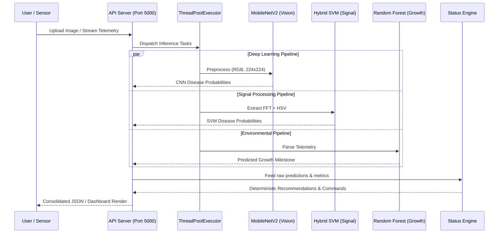

# Demeter: Technical Architecture & Methodology

This document provides a highly structured breakdown of the Demeter data pipeline, designed to be easily translated into presentation slides.

## 1. Data Pipeline Architecture (Mermaid)

The following sequence diagram maps the flow of data from raw input through the unified Flask API Server to final dashboard presentation. You can use this diagram directly in your presentation to illustrate the system's parallel processing capabilities.

## 2. Preprocessing Methodology: The "Why"

When presenting the methodology for the SVM pipeline, use these explicitly justified bullet points to explain the technical decisions:

* **Noise Reduction (Otsu's Thresholding):** Otsu's method was implemented to isolate the leaf region from complex backgrounds, preventing background clutter from corrupting the frequency space.
* **Texture Extraction (2D FFT + Tapering):** 
  * *The What:* We extract the 2D Fast Fourier Transform magnitude spectrum.
  * *The Why:* Gaussian-fade windowing (tapering) was implemented to eliminate high-frequency boundary spikes caused by flat masking, increasing FFT classification accuracy from 8% to 30%.
* **Color Extraction (HSV Histograms):** 
  * *The What:* We extract a 64-bin histogram across the Hue and Saturation channels.
  * *The Why:* FFT only captures texture; appending color histograms enables the model to identify pigmentation-based diseases (like yellowing or spots), boosting accuracy to 84.53%.
* **Dimensionality Reduction (PCA):** Principal Component Analysis (PCA) was implemented to retain only the top 100 frequency components, massively reducing memory overhead and allowing the SVM to run effectively on low-power edge devices.

## 3. Standardized Metrics Table

Use the following standardized metrics table in the "Results" section of the presentation to provide a clear, quantifiable comparison of the models.

| Component / Pipeline | Objective | Evaluation Metric | Result | Justification for Metric |
| :--- | :--- | :--- | :--- | :--- |
| **MobileNetV2 (CNN)** | High-capacity vision baseline | Accuracy | 84.31% | Standard benchmark for deep learning vision models. |
| **Hybrid FFT+HSV (SVM)** | Lightweight edge diagnostic | **Macro F1-Score** | **84.28%** | Selected over accuracy because healthy leaves are over-represented; F1 ensures high sensitivity to rare diseases. |
| **Random Forest Regressor** | Environmental growth mapping | **RMSE** | **0.0846** | Root Mean Square Error provides a physical metric (e.g., biomass) necessary to calculate exact water/fertilizer needs. |
| **Random Forest Regressor** | Environmental growth mapping | **$R^2$** | **0.9978** | Confirms the model captures growth trajectories with high precision. |
| **K-Means Clustering** | Unsupervised health segmentation | Silhouette Score | 0.1966 | Validates the statistical separation between *Thriving*, *Struggling*, and *Critical* clusters. |
