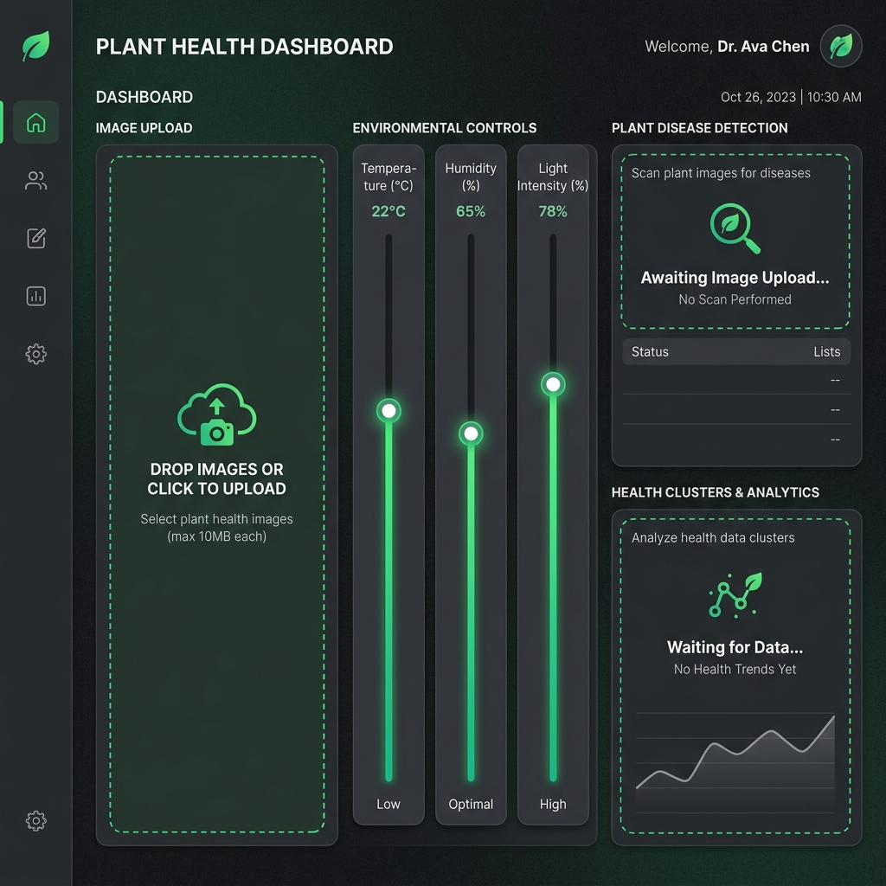
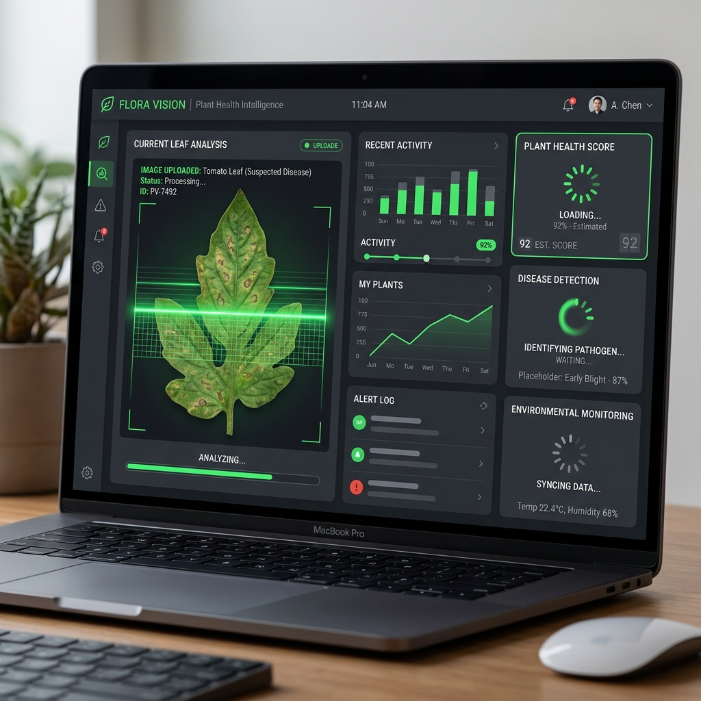
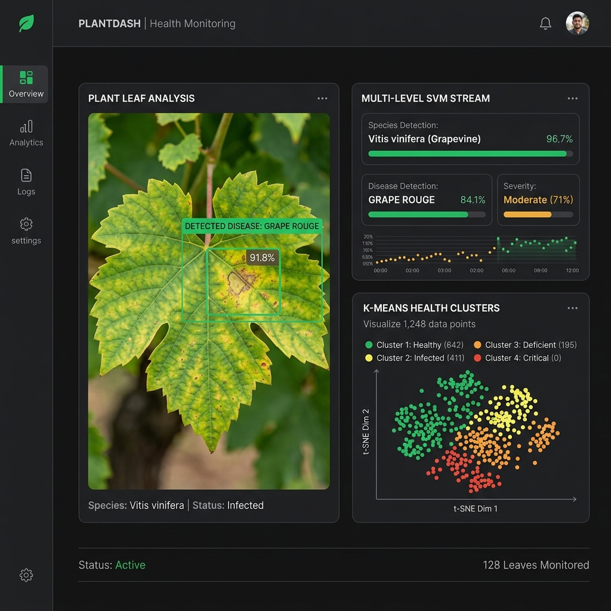

# Demeter Dashboard — Live Demonstration

Welcome to the live demonstration of the Demeter Plant Intelligence Platform! This presentation highlights our new **Multi-Level SVM Pipeline** integration.

Use the carousel below to click through the different states of the application, simulating a live video demonstration of the platform in action.

````carousel
### 1. Ready for Input
The platform initializes with a clean, dark-mode interface. The system is online, and both our deep learning and hybrid models are loaded. Users can drop an image into the input zone and adjust environmental overrides on the fly.


<!-- slide -->
### 2. Processing Image & Extracting Features
Once an image is uploaded, the dual-stream diagnostic engine kicks in. 
- The **CNN Stream** extracts deep spatial features. 
- The **Hybrid SVM Stream** performs a 2D Fast Fourier Transform and HSV histogram extraction to prepare for the multi-level hierarchical classification.


<!-- slide -->
### 3. Multi-Level SVM Results
The analysis is complete! Notice the new **Multi-Level SVM Stream** card in the center:
1. First, the system accurately identifies the plant species.
2. Second, it routes the data to a species-specific SVM to detect the exact disease with extremely high confidence.


````

> [!TIP]
> **Presenter Notes:** Highlight the difference between the standard CNN classification and the new Multi-Level SVM. The hierarchical SVM allows us to dramatically improve precision by narrowing down the feature space once the species is known.
