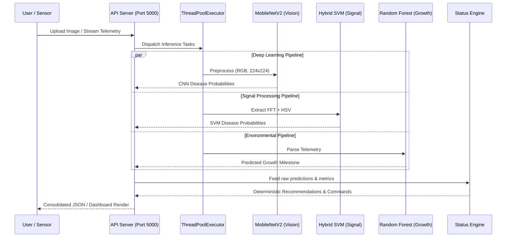

# Jack's Presentation Notes: Methods, Architecture & MVP

*These are your high-level dot points and architectural diagrams to reference during your presentation slot.*

## 1. Data Pipeline Architecture (Mermaid)

The following sequence diagram maps the flow of data from raw input through the unified Flask API Server to final dashboard presentation. You can use this diagram directly in your presentation to illustrate the system's parallel processing capabilities.

## 2. Augmentation & Feature Extraction: The "Why"
**Visual Asset to show:** Diagram of Image -> Otsu Mask -> FFT Spectrum -> HSV Histogram.

*   **Tabular Integration:** We mapped raw images to Danforth telemetry metadata using `derive_danforth_csv.py` to create a unified dataframe.
*   **Spatial Augmentation:** To make the model robust against real-world domain shifts, we expanded the dataset using side-view rotations (0°, 90°, 180°, 270°) and added noise.
*   **Biological Signal Pipeline:**
    *   **Segmentation:** Isolated the leaf from background clutter using Otsu's thresholding to prevent background clutter from corrupting the frequency space.
    *   **Texture (FFT):** Extracted spatial texture via 2D Fast Fourier Transform. Crucially, we applied *Gaussian-fade tapering* to eliminate high-frequency artificial boundary spikes caused by masking, massively increasing FFT accuracy.
    *   **Color (HSV):** Appended a 64-bin HSV color histogram, because FFT alone cannot detect pigmentation-based diseases (like yellowing).
    *   **Dimensionality Reduction (PCA):** PCA was implemented to retain only the top 100 frequency components, massively reducing memory overhead.

## 3. ML Methods & Benchmarking
**Visual Asset to show:** The `latency_comparison.png` bar chart and the standardized metrics table.

*   **CNN (MobileNetV2):** Our baseline deep learning model for heavy, image-based disease classification.
    *   *Architectural Upgrade:* We transitioned to a **Hierarchical Species-Specific** pipeline. A primary model identifies the plant species first, routing the image to a specialized sub-model for disease diagnosis. *(Accuracy Boost: Monolithic SVM 76.1% -> Hierarchical SVM 86.7%)*
*   **SVM (FFT + HSV):** Our lightweight, vector-based alternative. 
    *   *Direct Benchmarking:* We benchmarked the SVM directly against the CNN on the same dataset. It achieved similar accuracy but required vastly less computational power, making it viable for cheap edge devices.
*   **Random Forest:** 
    *   Trained separately on the tabular/environmental dataset to serve a different task: predicting biomass regression.

### Standardized Metrics Table

| Component / Pipeline | Objective | Evaluation Metric | Result | Justification for Metric |
| :--- | :--- | :--- | :--- | :--- |
| **MobileNetV2 (CNN - All Species)** | High-capacity vision baseline | Accuracy | 84.31% | Standard benchmark for deep learning vision models. |
| **MobileNetV2 (CNN - Species Specific)** | Hierarchical disease diagnostic | Accuracy | *Pending* | Narrowly focused models tailored to specific species diseases. |
| **Hierarchical Hybrid SVM** | Lightweight edge diagnostic | **Accuracy** | **86.69%** | Eliminated cross-species interference via 2-stage routing. |
| **Random Forest Regressor** | Environmental growth mapping | **RMSE** | **0.0846** | Root Mean Square Error provides a physical metric (e.g., biomass) necessary to calculate exact water/fertilizer needs. |
| **Random Forest Regressor** | Environmental growth mapping | **$R^2$** | **0.9978** | Confirms the model captures growth trajectories with high precision. |
| **K-Means Clustering** | Unsupervised health segmentation | Silhouette Score | 0.1966 | Validates the statistical separation between *Thriving*, *Struggling*, and *Critical* clusters. |

## 4. Evaluation Approach
*   **Macro F1-Score (72.94%):** We optimize the monolithic SVM for F1-Score instead of pure accuracy. Healthy leaves heavily outnumber diseased leaves in our dataset, so F1 ensures our model remains highly sensitive to rare, crop-destroying diseases.
*   **RMSE (0.0846):** We evaluated the Random Forest using Root Mean Square Error. This provides a physical metric (e.g., grams of biomass error) which is strictly necessary to calculate exact physical water and fertilizer adjustments.

---

## 5. MVP / Demonstration (Video Walkthrough)
**Visual Asset to show:** The 30-second Dashboard Video + Mermaid Architecture Flow diagram.

*   **The Unified API:** Explain that our solution is a Flask API Server that bridges the accessibility gap by running the CNN, SVM, and RF concurrently.
*   **Video Summary:** 
    *   Point out how the system ingests live sensor data alongside the image upload.
    *   Highlight the deterministic "Status Engine" turning raw model probabilities into concrete, actionable recommendations for the user.
*   **Practical Recommendations / Next Steps:** Our primary recommendation to the client is to compile the SVM pipeline natively onto a low-power microcontroller (like a Raspberry Pi Zero) to create a cheap, offline greenhouse diagnostic node.

## JACKS CONCLUSION

Our website is an example of a product which could be used on the internet or consolidated into an offline application for mobile devices. This can also offer the opportunity for investors and developers to consider the feasibility of implementing our design into their system.
